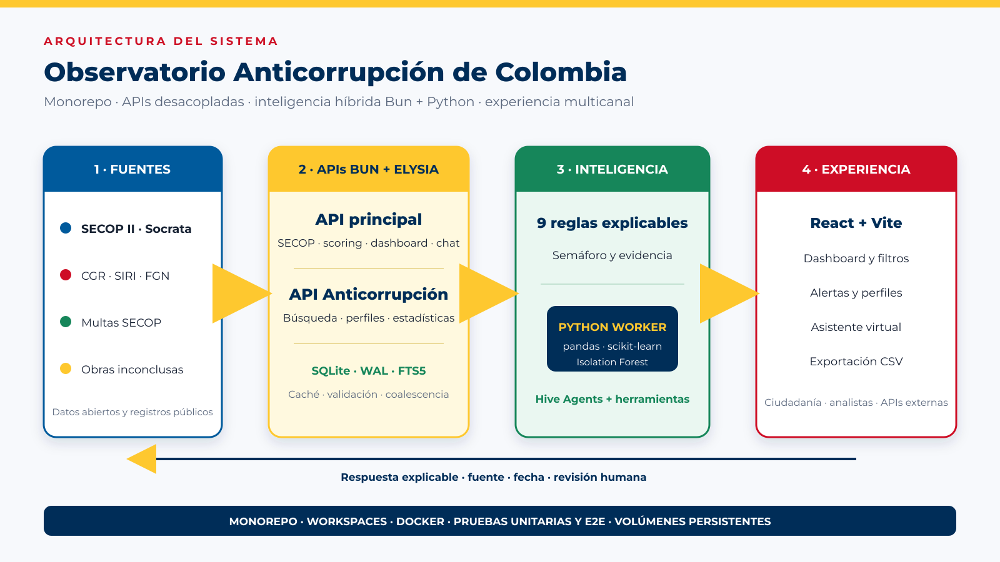

# Infraestructura: monorepo, Bun, Elysia y Python para ML

## Propósito

Este documento explica la decisión de construir el Observatorio como un monorepo TypeScript/Bun con servicios Elysia y un trabajador Python especializado para aprendizaje automático. También describe rendimiento, seguridad, grandes consultas, límites y ruta de escalamiento.

## Resumen de la decisión

La arquitectura no enfrenta Bun contra Python como si uno fuera universalmente superior. Cada tecnología se usa donde aporta mayor valor:

- Bun y Elysia: servidor HTTP, validación, concurrencia de I/O, workspaces, procesos y SQLite.
- React/Vite: experiencia web.
- Hive Agents: conversación y herramientas.
- Python, pandas y scikit-learn: preparación de matriz y Isolation Forest.
- Docker: empaquetado y aislamiento operativo.

El resultado es una plataforma híbrida: la ruta frecuente permanece en Bun; el trabajo científico se ejecuta en Python y persiste resultados para consumo rápido.

## ¿Por qué un monorepo?

El proyecto contiene componentes que evolucionan juntos:

- Frontend.
- API principal.
- API Anticorrupción Colombia.
- Runtime y paquetes de agentes.
- Modelo Python.
- Pruebas, Docker y documentación.

Separarlos en repositorios diferentes desde el inicio aumentaría coordinación, versiones y cambios incompatibles. El monorepo permite:

### Contratos coordinados

Cuando cambia el formato de un score, API, frontend y pruebas se actualizan en un único cambio. Los paquetes internos usan `workspace:*`, evitando publicar una versión intermedia solo para probar integración.

### Una instalación coherente

El `package.json` raíz declara los workspaces y el lockfile fija versiones. Esto reduce diferencias entre desarrollo, pruebas y construcción de imágenes.

### Pruebas de extremo a extremo

Una sola orden puede ejecutar scorer, caché, API institucional, chat y UI. El E2E atraviesa datos.gov.co, persistencia, ML y contrato de interfaz.

### Docker reproducible

Cada servicio conserva su Dockerfile y contexto, pero se construye desde una fuente coordinada. La API principal puede copiar el paquete Hive sin publicar artefactos externos.

### Refactorización segura

Las búsquedas globales permiten encontrar consumidores antes de cambiar una bandera o endpoint. Esto es especialmente valioso en una solución pequeña que aún está definiendo contratos.

## Límites del monorepo

Un monorepo no escala automáticamente. Puede aumentar tiempos de CI, tamaño de contexto Docker y acoplamiento organizacional. Las medidas recomendadas son:

- Caché de dependencias y builds.
- Pipelines por rutas modificadas.
- Límites claros entre paquetes.
- Propietarios de código.
- Evitar importaciones cruzadas no declaradas.
- Imágenes multi-stage y `.dockerignore` estrictos.

Si los equipos adquieren ciclos completamente independientes, algunos servicios pueden extraerse sin cambiar sus contratos HTTP.

## ¿Por qué Bun?

Bun reúne runtime JavaScript/TypeScript, gestor de paquetes, test runner, procesos y SQLite. En este proyecto reduce herramientas y mantiene el código de API, frontend y agentes en el mismo ecosistema.

### Ruta TypeScript directa

La API ejecuta TypeScript sin una compilación intermedia obligatoria en desarrollo. Los tipos compartidos reducen errores de integración.

### I/O concurrente

La carga dominante es esperar Socrata, leer SQLite, consultar la API institucional y llamar modelos. El modelo asíncrono permite atender otras solicitudes mientras existen esperas de red.

### SQLite integrado

`bun:sqlite` evita una capa adicional para persistencia local. El sistema activa WAL e índices para permitir lecturas frecuentes y escrituras controladas.

### Procesos

`Bun.spawn` ejecuta el trabajador Python y captura salida sin convertir Python en el servidor principal.

### Workspaces y pruebas

Bun instala paquetes internos y ejecuta tests en el mismo flujo. Esto simplifica el monorepo.

## ¿Por qué Elysia?

Elysia proporciona rutas declarativas, prefijos, plugins y esquemas de validación. El código limita consultas como `limit`, define parámetros opcionales y concentra errores por módulo.

La validación tipada reduce entradas inválidas antes de la lógica de negocio. No reemplaza seguridad, pero mejora consistencia. Swagger en la API Anticorrupción convierte rutas en una interfaz explorable.

## Rendimiento: qué sí podemos afirmar

El diseño busca baja sobrecarga y buena concurrencia, pero el rendimiento final depende de fuente, consulta, tamaño de respuesta, índices, hardware y red. No se debe afirmar que Bun “garantiza” velocidad.

Las medidas concretas del repositorio son:

- Selección explícita de campos Socrata.
- Filtros y agregaciones ejecutados cerca de la fuente.
- Límites de hasta 500 contratos por perfil.
- Lotes de NIT con concurrencia cinco.
- TTL de scores de una hora.
- Caché Socrata en memoria y SQLite.
- Caché de dashboard persistente.
- Solicitudes en vuelo compartidas.
- Stale-while-revalidate.
- Warmup de sectores.
- Índices SQLite y FTS5.

## Grandes volúmenes por petición

La frase correcta no es “aceptamos cualquier volumen”. El sistema está preparado para consultas costosas mediante controles explícitos.

### Timeout coordinado

Socrata puede tardar varios minutos en agregaciones. El cliente usa un timeout de 300 segundos. El servidor Bun desactiva su `idleTimeout` para no cortar antes la operación.

### Reducción en origen

SoQL selecciona columnas, agrupa y ordena en datos.gov.co. Esto evita descargar millones de filas cuando solo se necesita un agregado.

### Paginación y límites

Los endpoints limitan resultados y offsets. El scorer individual recupera como máximo 500 contratos y el batch sectorial trabaja con un número controlado de NIT.

### Coalescencia

Si varias personas solicitan el mismo sector, comparten un cálculo en vuelo. Esto evita multiplicar la presión sobre Socrata y Python.

### Persistencia

La respuesta procesada queda en SQLite. Las siguientes peticiones consultan localmente y la actualización puede ocurrir en segundo plano.

### Evolución para cargas mayores

- Respuestas en streaming para exportaciones.
- Jobs asíncronos con identificador.
- Colas y workers.
- Partición por sector o fecha.
- Almacén analítico columnar.
- Límites por usuario y cuotas.

## Seguridad por capas

Ningún framework garantiza seguridad. Bun y Elysia aportan primitives, pero la seguridad depende de decisiones.

### Controles actuales

- Esquemas Elysia para consultas.
- Límites máximos en paginación.
- Consultas SQLite parametrizadas.
- Escapado básico de valores SoQL.
- Variables de entorno para secretos.
- Servicios internos en red Docker.
- HTTPS, HSTS y redirección en Traefik.
- Contenedores y volúmenes separados.
- Registro de excepciones sin detener el proceso.

### Aspectos a fortalecer

- CORS restringido a dominios permitidos.
- Rate limiting por IP o token.
- Autenticación y autorización para administración.
- Validación más estricta de filtros SoQL.
- Auditoría de consultas sensibles.
- Escaneo de dependencias e imágenes.
- Usuario no root en imágenes.
- Políticas de retención de historial.
- Gestión centralizada de secretos.
- Pruebas de carga y seguridad.

## ¿Por qué no usar Python puro para toda la API?

Python podría implementar todo el sistema y cuenta con frameworks maduros. La decisión no implica que Python sea lento o inseguro por definición. El criterio es mantener la mayor parte del producto en un ecosistema TypeScript y usar Python donde su ventaja es mayor.

### Ventajas del enfoque híbrido

- Tipos compartidos entre API, frontend y agentes.
- Menos traducción de contratos.
- Runtime eficiente para I/O frecuente.
- Un único gestor para la mayoría de paquetes.
- Acceso directo a scikit-learn y pandas sin reimplementarlos.
- Modelo reemplazable detrás de un proceso o futuro servicio.

### Costos de Python puro en este contexto

- Duplicación de modelos de datos TypeScript/Python.
- Dos ecosistemas para una ruta que principalmente hace I/O.
- Mayor coordinación entre frontend, agente y backend.
- Riesgo de mezclar dependencia científica pesada con cada réplica web.
- Escalar API y ML juntos aunque tengan perfiles de recursos diferentes.

### Cuándo Python puro sería razonable

- Si el producto estuviera dominado por inferencia continua.
- Si el equipo fuera principalmente Python.
- Si los modelos requirieran una API científica estrechamente integrada.
- Si se usara FastAPI con contratos generados y workers separados.

La arquitectura actual deja abierta esa evolución porque el modelo ya está aislado.

## Flujo Bun–Python

1. La API obtiene contratos y persiste características.
2. Bun ejecuta `anomaly_scorer.py` con sector y ruta de base.
3. Python carga NIT y contratos con pandas.
4. Construye nueve características.
5. Normaliza con `StandardScaler`.
6. Entrena Isolation Forest.
7. Escribe `anomaly_scores` en SQLite.
8. Bun incorpora la bandera y responde desde su contrato habitual.

Si Python falla, la API registra una advertencia y continúa con reglas determinísticas. Esto es degradación funcional, no caída completa.

## Persistencia actual

SQLite es una decisión pragmática:

- Cero servicio adicional.
- Buen rendimiento local.
- Transacciones.
- WAL.
- FTS5.
- Fácil volumen Docker.

No es la meta final para múltiples réplicas independientes. Compartir un archivo SQLite sobre almacenamiento de red introduce contención y riesgos.

## Escalamiento por etapas

### Etapa 1 — Nodo único endurecido

- Métricas de latencia y errores.
- Copias de seguridad.
- Límites y CORS.
- Automatización de datasets.
- Pruebas de carga.

### Etapa 2 — Servicios replicables

- Frontend y API principal sin estado local.
- PostgreSQL para perfiles, scores e historial.
- Redis para caché y coordinación.
- API Anticorrupción con réplica de lectura.

### Etapa 3 — ML asíncrono

- Cola de trabajos.
- Workers Python independientes.
- Registro de versión del modelo y características.
- Reentrenamiento programado.
- Almacenamiento de artefactos.

### Etapa 4 — Analítica masiva

- ClickHouse, BigQuery o equivalente.
- Partición por fecha y sector.
- Preagregados.
- Exportación asíncrona.
- Retención y gobierno de datos.

### Etapa 5 — Plataforma multi-entidad

- Autenticación federada.
- Roles y políticas por entidad.
- Cuotas y facturación si aplica.
- Catálogo de APIs.
- Observabilidad distribuida.
- Despliegue orquestado.

## Escalabilidad organizacional

El monorepo también escala mediante límites de propiedad:

- Producto y frontend.
- Plataforma y APIs.
- Datos y calidad.
- ML y evaluación.
- Operaciones y seguridad.

Cada módulo conserva contrato, pruebas y responsable. La extracción a repositorios separados debe responder a una necesidad organizacional real, no a una moda.

## Preguntas técnicas frecuentes

### ¿Bun garantiza velocidad?

No. Reduce sobrecarga en ciertos escenarios. La velocidad se demuestra con medición y depende principalmente de las consultas externas y el diseño de caché.

### ¿Elysia garantiza seguridad?

No. Aporta validación y estructura. La seguridad requiere autenticación, límites, configuración, actualizaciones y operación.

### ¿Por qué SQLite si existen millones de contratos?

No se replica el dataset completo de SECOP II. Se persisten contratos y agregados consultados. Para ingesta masiva o réplicas horizontales se propone PostgreSQL/ClickHouse.

### ¿El proceso Python bloquea la API?

El batch espera cuando necesita aplicar el resultado, pero Python se ejecuta como subproceso. Una evolución natural es enviarlo a una cola y responder con estado de trabajo.

### ¿Cómo evitan saturar Socrata?

Selección de campos, agregación, TTL, persistencia, coalescencia, warmup secuencial y concurrencia controlada.

### ¿Qué parte se replica primero?

Frontend y API HTTP. Antes se debe extraer estado compartido a Redis/PostgreSQL.

## Mensaje de defensa

> Elegimos un monorepo porque los contratos de frontend, APIs, agentes y ML evolucionan juntos. Bun y Elysia mantienen rápida y tipada la ruta HTTP; Python se usa como motor científico especializado. No dependemos de una promesa de velocidad del framework: aplicamos filtros, límites, caché, persistencia y coalescencia. La separación actual permite escalar cada carga por separado cuando el volumen lo requiera.

## Conclusión

La arquitectura híbrida reduce complejidad sin renunciar al ecosistema de ML. El monorepo acelera coordinación; las APIs preservan límites; Python aporta ciencia de datos; Docker reproduce el entorno. La ruta de escala está definida y reconoce que seguridad, rendimiento y disponibilidad son propiedades del sistema completo, no de una sola tecnología.
